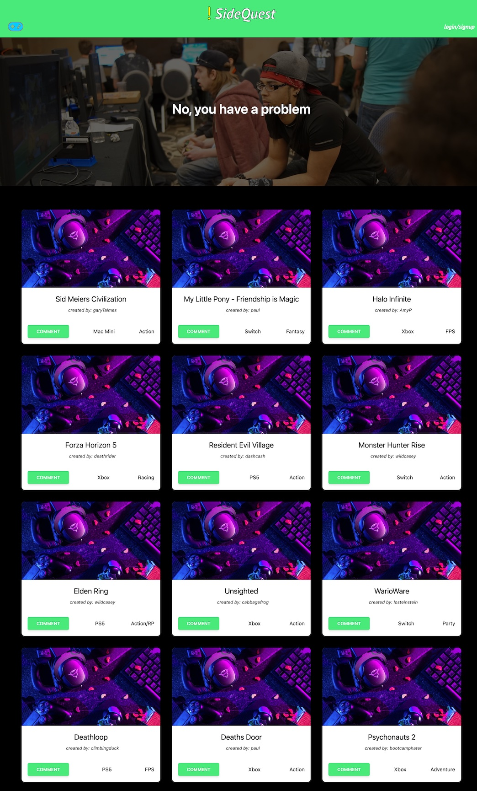

# Project 2: SideQuest
-------
## Table of Content

- [Description](#description)
- [Image](#image)
- [Site URL](#site-url)
- [GitHub Repository](#github-repository)
- [Authors](#authors)  
- [Contributors](#contributors)
- [Technologies Used](#technologies-used) 
- [License](#license)

-------
## Description:  

SideQuest is an online community site for gamers to post their favorite games with the ability to discuss their game collections with fellow gamers.

------
## Image:

------
## Site URL

- [Deployed SideQuest Page](https://sidequest-p2.herokuapp.com/)

## Github Repository:

- [Github Repository for Project 2: Side Quest](https://github.com/ksjefferies/SideQuest)

## Authors:

- [Kelly Jefferies](https://github.com/ksjefferies)
- [Victor Kennedy](https://github.com/Victorini1)
- [Stephen Elliott](https://github.com/UsernameisStephen)

## Technologies Used:

  

## License:

